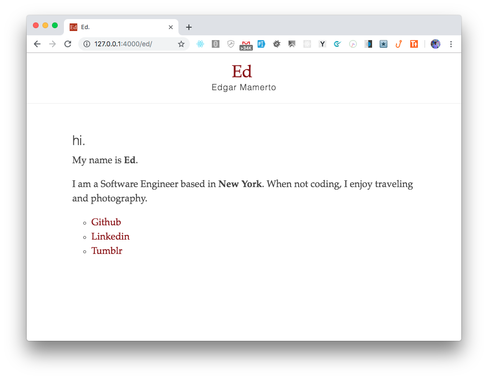

# Ed
> Just playing with Jekyll



##  Install dependencies
```sh
$ bundle install
```
## Troubleshooting
If you get this error on bundle install
```shell
$ bundle install
Fetching gem metadata from https://rubygems.org/..........
Fetching gem metadata from https://rubygems.org/.
Resolving dependencies...
Bundler could not find compatible versions for gem "bundler":
  In Gemfile:
    bundler (~> 1.16)

  Current Bundler version:
    bundler (2.0.1)
This Gemfile requires a different version of Bundler.
Perhaps you need to update Bundler by running `gem install bundler`?

Could not find gem 'bundler (~> 1.16)' in any of the relevant sources:
```
Do this
```
$ sudo gem uninstall bundler -v 2.0.1
$ sudo gem install bundler -v 1.16
$ bundle install
```
## Run
```sh
$ bundle exec jekyll serve
```
